# **Java Performance Profiling & Optimization Guide**

## 🧭 Overview

Explains why performance profiling is crucial in modern Java applications, how JVM internals affect runtime performance, and when to profile.

## ⚙️ Types of Profilers

* **Sampling vs Instrumentation**
* JVM-level agent profilers
* APM-based profilers (AppDynamics, Dynatrace, etc.)

## 🔧 Developer-Focused Profiling

### 1. VisualVM

* Installation & setup
* Connecting to local and remote JVMs
* Heap, thread, and CPU analysis
* Live GC and memory tracking

### 2. JProfiler

* Integration with IDEs
* Profiling method calls, memory, and SQL queries
* CLI and CI usage

### 3. Eclipse MAT (Memory Analyzer Tool)

* Analyzing heap dumps
* Detecting leaks and high-retention objects

---

## 🧱 Production-Safe Profiling

### 1. Java Flight Recorder (JFR)

* Recording JVM events with minimal overhead
* Integrating with Mission Control
* Triggering recordings via CLI or JMX

### 2. Async Profiler

* Lightweight CPU sampling
* Flame graph visualization
* Continuous profiling with Grafana

### 3. JMX Monitoring

* Exposing JVM metrics
* Integration with Prometheus & Grafana

---

## 🚀 Profiling a Spring Boot Application

* JVM flags for enabling profiling
* Attaching profilers to a running app
* Sample setup for local and Docker environments
* Typical troubleshooting scenarios

---

## 🧪 CI/CD Integration

* Using JProfiler CLI or VisualVM headless mode
* Profiling performance tests in Jenkins/GitHub Actions
* Automatically generating flame graphs and reports

---

## ✅ Best Practices & Troubleshooting

* When to profile vs when to monitor
* Avoiding overhead in production
* GC tuning strategies
* Combining logs, metrics, and traces

---

## 📊 Example Architecture Diagram

A visual layout of **profiling + observability** pipeline:

```mermaid
graph TD
A[Application JVM] --> B[Profiler Agent]
B --> C[Java Flight Recorder / Async Profiler]
C --> D[Metrics Exporter]
D --> E[Prometheus]
E --> F[Grafana Dashboard]
B --> G[Heap Dump → Eclipse MAT]
```

---

## 📚 References

* Oracle Docs — Java Mission Control & JFR
* JProfiler Documentation
* VisualVM Official Wiki
* Eclipse Memory Analyzer (MAT)
* Async Profiler & FlameGraph Repos
